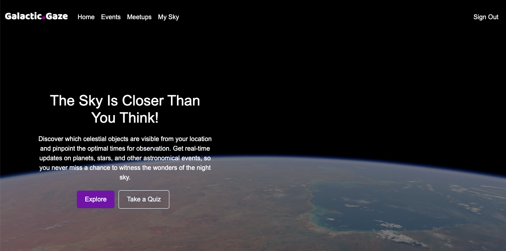
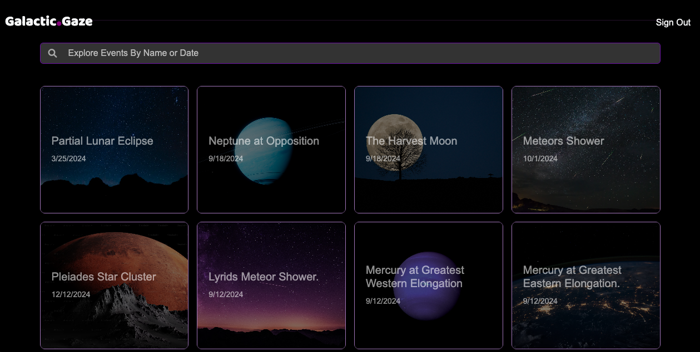
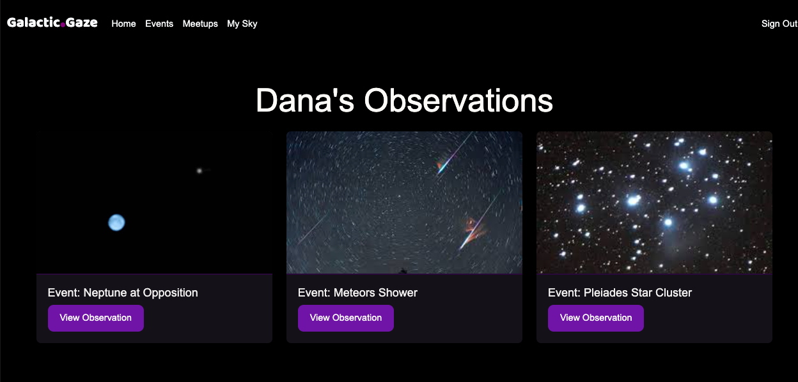
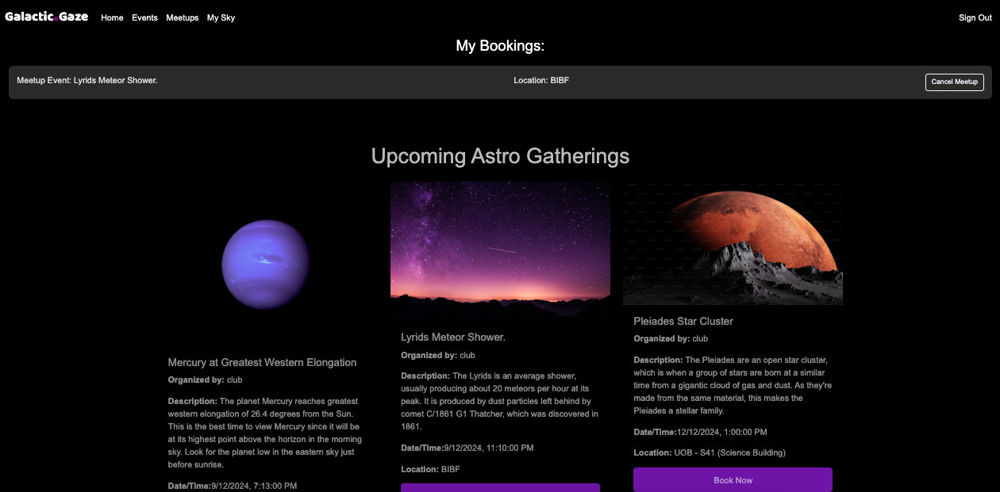

# Galactic Gaze

## Description
**Galactic Gaze** is a platform dedicated to astronomy enthusiasts where users can discover celestial events, share their sky observations, and connect with fellow stargazers. Clubs can also create meetups for events, allowing users to book these meetups. Whether you're a beginner or an expert, Galactic Gaze offers a community-driven experience that enhances your astronomical journey.

## Getting Started
The project plan can be viewed [here](https://trello.com/b/Pc8wrc7b).

<b>User Stories</b>

1. As a user, I want to view upcoming celestial events.
2. As a user, I want to share my sky observations with the community.
3. As a user, I want to connect and chat with other stargazers.
4. As a user, I want to receive reminders for upcoming events.
5. As a user, I want to contribute to discussions about celestial phenomena.
6. As a user, I want to book meetups created by clubs for celestial events.
7. As an admin, I want to manage events and user content effectively.
8. As an admin, I want to track user engagement and contributions.
9. As a club, I want to create, edit, delete a meetup.

## Technologies Used
- React
- JSX
- JavaScript
- CSS
- HTML
- MongoDB
- Express
- Node.js
- Bootstrap

## Next Steps
1. **Event Calendar:** Implement a calendar feature for users to visualize upcoming celestial events.
2. **Observation Tools:** Provide tools for users to log and track their observations.
3. **User Profiles:** Allow users to create profiles showcasing their contributions and interests.
4. **Forum Discussions:** Introduce a forum for deeper discussions on various astronomy topics.
5. **Mobile App Development:** Consider developing a mobile app for easier access to features on-the-go.

## Screenshots

## Backend Repository Link
The backend repository can be viewed [here](https://github.com/zainabdhaif/galactic-gaze-back-end.git).

## Credits
### React + Vite
This template provides a minimal setup to get React working in Vite with HMR and some ESLint rules.

Currently, two official plugins are available:
- [@vitejs/plugin-react](https://github.com/vitejs/vite-plugin-react/blob/main/packages/plugin-react/README.md) uses [Babel](https://babeljs.io/) for Fast Refresh.
- [@vitejs/plugin-react-swc](https://github.com/vitejs/vite-plugin-react-swc) uses [SWC](https://swc.rs/) for Fast Refresh.

---

Feel free to customize this README further to match the specific features and branding of the **Galactic Gaze** project!

# React + Vite

This template provides a minimal setup to get React working in Vite with HMR and some ESLint rules.

Currently, two official plugins are available:

- [@vitejs/plugin-react](https://github.com/vitejs/vite-plugin-react/blob/main/packages/plugin-react/README.md) uses [Babel](https://babeljs.io/) for Fast Refresh
- [@vitejs/plugin-react-swc](https://github.com/vitejs/vite-plugin-react-swc) uses [SWC](https://swc.rs/) for Fast Refresh
